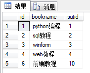
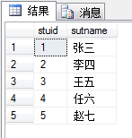
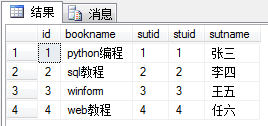
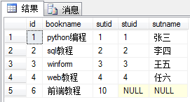
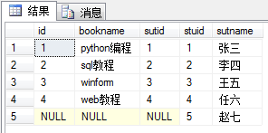
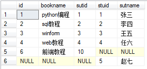
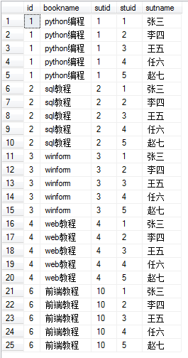

# SQL的几种连接

SQL连接可以分为内连接、外连接、交叉连接。

连接条件可在FROM或WHERE子句中指定，建议在FROM子句中指定连接条件。WHERE和HAVING子句也可以包含搜索条件，以进一步筛选连接条件所选的行。

数据库实例（book表和stu表）：  



### 1. 内连接

内连接：内连接查询操作列出与连接条件匹配的数据行，它使用比较运算符比较被连接列的列值。  
* 等值连接：在连接条件中使用等于号(=)运算符比较被连接列的列值，其查询结果中列出被连接表中的所有列，包括其中的重复列。
* 不等值连接：在连接条件使用除等于运算符以外的其它比较运算符比较被连接的列的列值。这些运算符包括`>、>=、<=、<、!>、!<和<>。`
* 自然连接：在连接条件中使用等于(=)运算符比较被连接列的列值，但它使用选择列表指出查询结果集合中所包括的列，并删除连接表中的重复列。

```
SELECT * from book as a, stu as b where a.sutid = b.stuid
SELECT * FROM book AS a INNER JOIN stu AS b ON a.stuid = b.stuid
```
内连接可以使用上面两种方式，其中第二种的inner关键词可以省略。  


### 2. 外连接

```
LEFT/RIGNT/FULL [OUTER] JOIN
```

#### 2.1 左（向外）连接

左向外连接的结果集包括LEFT  OUTER子句中指定的左表的所有行，而不仅仅是连接列所匹配的行。如果左表的某行在右表中没有匹配行，则在相关联的结果集行中右表的所有选择列表列均为空值。

以左表为基准，将a.stuid = b.stuid的数据进行连接，然后将左表没有的对应项显示，右表的列为NULL。
```
SELECT * FROM book AS a LEFT JOIN stu AS b ON a.stuid = b.stuid
```


#### 2.2 右（向外）连接

右向外连接是左向外连接的反向连接。将返回右表的所有行。如果右表的某行在左表中没有匹配行，则将为左表返回空值。

是以右表为基准，将a.stuid = b.stuid的数据进行连接，然以将右表没有的对应项显示，左表的列为NULL。
```
SELECT * FROM book AS a RIGHT JOIN stu AS b ON a.stuid = b.stuid
```


#### 2.3 全连接

完整外部连接返回左表和右表中的所有行。当某行在另一个表中没有匹配行时，则另一个表的选择列表列包含空值。如果表之间有匹配行，则整个结果集行包含基表的数据值。

```
SELECT * FROM book AS a FULL JOIN stu AS b ON a.stuid = b.stuid
```


### 3. 交叉连接

交叉联接返回左表中的所有行，左表中的每一行与右表中的所有行组合。交叉联接也称作笛卡尔积。

```
SELECT * FROM book AS a CROSS JOIN stu AS b ON a.stuid = b.stuid
```


Ref.:  
[SQL的几种连接：内连接、左联接、右连接、全连接、交叉连接](http://www.cnblogs.com/zxlovenet/p/4005256.html)  
[SQL 左外连接，右外连接，全连接，内连接](http://www.cnblogs.com/youzhangjin/archive/2009/05/22/1486982.html)  

