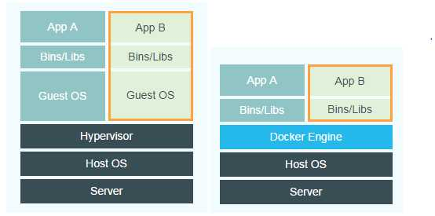

# Docker和虚拟机的区别

直观上来说，VM多了一层Guest OS，同时Hyoervisor会对硬件资源进行虚拟化，而Docker直接使用硬件资源。  
此外，因为Docker是直接利用宿主机的系统内核，所以可以在很短时间内创建大量容器。  
服务器虚拟化解决的核心问题是资源调配，而容器解决的核心问题是应用开发、测试和部署。

Ref.:  
[docker容器与虚拟机有什么区别？ - water Cc的回答 - 知乎](https://www.zhihu.com/question/48174633/answer/109868326)  
[docker容器与虚拟机有什么区别？ - 网易云的回答 - 知乎](https://www.zhihu.com/question/48174633/answer/218092411)

------

下面这部分来自第二个回答，引申阅读。

虚拟机技术通过Hypervisor层抽象底层基础设施资源，提供相互隔离的虚拟机，通过统一配置、统一管理，计算资源的可运维性，以及资源利用率都能够得到有效的提升。同时，虚拟机提供客户机操作系统，客户机变化不会影响宿主机，能够提供可控的测试环境，更能够屏蔽底层硬件甚至基础软件的差异性，让应用做到的广泛兼容。然而，再牛逼的虚拟化技术，都不可避免地出现计算、IO、网络性能损失，毕竟多了一层软件，毕竟要运行一个完整的客户机操作系统。  
容器技术严格来说并不是虚拟化，没有客户机操作系统，是共享内核的。容器可以视为软件供应链的集装箱，能够把应用需要的运行环境、缓存环境、数据库环境等等封装起来，以最简洁的方式支持应用运行，轻装上阵，当然是性能更佳。Docker镜像特性则让这种方式简单易行。当然，因为共享内核，容器隔离性也没有虚拟机那么好。  
但是，更重要的是，通过Docker的特性，以容器化封装为基础，企业就可以很好地实现云原生（向云而生的架构），包括大家听得耳朵都起茧子的微服务架构、DevOps，让开发团队可以从苦逼的运维工作中解脱，让应用快速上线、快速迭代。微服务架构下，将系统拆分成多个服务，每个部分都可以独立开发测试部署，同时我们也可以只扩展需要扩展的部分，也就是变一个三头六臂的哪吒，而不是总要变三个孙悟空。微服务如何设计，基于容器的规模部署、高可用如何实现等，是另外的问题了。
