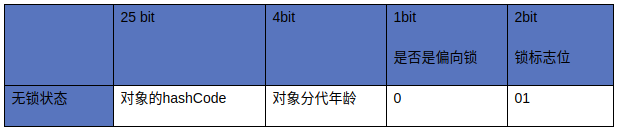
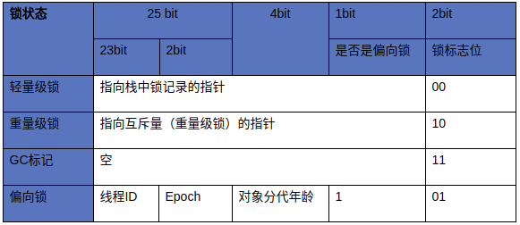
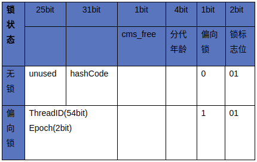
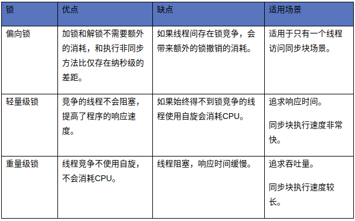

# synchronized

一般称synchronized为重量级锁。  
Java 1.6为了减少获得锁和释放锁带来的性能消耗而引入的偏向锁和轻量级锁，以及锁的存储结构和升级过程。

### 1. 同步的基础

Java中的每一个对象都可以作为锁：  
* 对于同步方法，锁是当前实例对象。
* 对于静态同步方法，锁是当前对象的Class对象。
* 对于同步方法块，锁是Synchonized括号里配置的对象。

当一个线程试图访问同步代码块时，它首先必须得到锁，退出或抛出异常时必须释放锁。

### 2. 同步的原理

JVM规范规定JVM基于进入和退出Monitor对象来实现方法同步和代码块同步，但两者的实现细节不一样。  
代码块同步是使用monitorenter和monitorexit指令实现，而方法同步是使用另外一种方式实现的，细节在JVM规范里并没有详细说明，但是方法的同步同样可以使用这两个指令来实现。

monitorenter指令是在编译后插入到同步代码块的开始位置，而monitorexit是插入到方法结束处和异常处，JVM要保证每个monitorenter必须有对应的monitorexit与之配对。  
任何对象都有一个monitor与之关联，当且一个monitor被持有后，它将处于锁定状态。线程执行到monitorenter指令时，将会尝试获取对象所对应的monitor的所有权，即尝试获得对象的锁。

#### 2.1 对象头

锁存在Java对象头里。如果对象是数组类型，则虚拟机用3个Word（字宽）存储对象头，如果对象是非数组类型，则用2字宽存储对象头。在32位虚拟机中，一字宽等于四字节，即32bit。  
长度|内容|说明
:--|:--|:--
32/64bit|Mark Word|存储对象的hashCode或锁信息等
32/64bit|Class Metadata Address|存储到对象类型数据的指针
32/64bit|Array length|数组的长度（如果当前对象是数组）

Java对象头里的Mark Word里默认存储对象的HashCode，分代年龄和锁标记位。32位JVM的Mark Word的默认存储结构如下：  

在运行期间Mark Word里存储的数据会随着锁标志位的变化而变化。Mark Word可能变化为存储以下4种数据：  

在64位虚拟机下，Mark Word是64bit大小的，其存储结构如下：  

#### 2.2 锁的升级

Java 1.6为了减少获得锁和释放锁所带来的性能消耗，引入了“偏向锁”和“轻量级锁”。  
所以在Java 1.6里锁一共有四种状态：  
* 无锁状态
* 偏向锁状态
* 轻量级锁状态
* 重量级锁状态

锁会随着竞争情况逐渐升级。  
锁可以升级但**不能降级**，意味着偏向锁升级成轻量级锁后不能降级成偏向锁。这种锁升级却不能降级的策略，目的是为了提高获得锁和释放锁的效率。  

关于偏向锁和轻量级锁的介绍，请阅读引用1。

#### 2.3 锁的优缺点和对比

Ref.:  
[聊聊并发（二）——Java SE1.6中的Synchronized](http://www.infoq.com/cn/articles/java-se-16-synchronized)  

