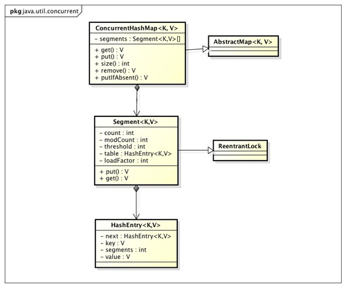

# ConcurrentHashMap

### 1. 线程不安全的HashMap

因为多线程环境下，使用HashMap进行put操作会引起死循环，导致CPU利用率接近100%，所以在并发情况下不能使用HashMap，如以下代码:  
```
final HashMap<String, String> map = new HashMap<String, String>(2);
Thread t = new Thread(new Runnable() {
    @Override
    public void run() {
        for (int i = 0; i < 10000; i++) {
            new Thread(new Runnable() {
                @Override
                public void run() {
                    map.put(UUID.randomUUID().toString(), "");
                }
            }, "ftf" + i).start();
        }
    }
}, "ftf");
t.start();
t.join();
```

### 2. 效率低下的HashTable容器

HashTable容器使用synchronized来保证线程安全，但在线程竞争激烈的情况下HashTable的效率非常低下。  
因为当一个线程访问HashTable的同步方法时，其他线程访问HashTable的同步方法时，可能会进入阻塞或轮询状态。如线程1使用put进行添加元素，线程2不但不能使用put方法添加元素，并且也不能使用get方法来获取元素，所以竞争越激烈效率越低。

### 3. 锁分段技术

HashTable容器在竞争激烈的并发环境下表现出效率低下的原因是所有访问HashTable的线程都必须竞争同一把锁。  
那假如容器里有多把锁，每一把锁用于锁容器其中一部分数据，那么当多线程访问容器里不同数据段的数据时，线程间就不会存在锁竞争，从而可以有效的提高并发访问效率，这就是ConcurrentHashMap所使用的锁分段技术：首先将数据分成一段一段的存储，然后给每一段数据配一把锁，当一个线程占用锁访问其中一个段数据的时候，其他段的数据也能被其他线程访问。

### 4. ConcurrentHashMap的结构



ConcurrentHashMap是由Segment数组结构和HashEntry数组结构组成。  
Segment是一种可重入锁ReentrantLock，在ConcurrentHashMap里扮演锁的角色，HashEntry则用于存储键值对数据。  
。一个ConcurrentHashMap里包含一个Segment数组，Segment的结构和HashMap类似，是一种数组和链表结构， 一个Segment里包含一个HashEntry数组，每个HashEntry是一个链表结构的元素， 每个Segment守护者一个HashEntry数组里的元素,当对HashEntry数组的数据进行修改时，必须首先获得它对应的Segment锁。

### 5. ConcurrentHashMap的方法

具体的读引用1吧。

初始化：segments数组的长度必须是大于或等于concurrencyLevel的最小的2的N次方，最大为65536（concurrency的最大值为65535）。

get()：整个get过程不需要加锁，除非读到的值为空才会加锁重读。  
ConcurrentHashMap的get方法里将要使用的共享变量都定义成volatile，如用于统计当前Segement大小的count字段和用于存储值的HashEntry的value。定义成volatile的变量，能够在线程之间保持可见性，能够被多线程同时读，并且保证不会读到过期的值，但是只能被单线程写（有一种情况可以被多线程写，就是写入的值不依赖于原值），在get操作里只需要读不需要写共享变量count和value，所以可以不用加锁。  
所以不会读到过期的值，是根据java内存模型的happen before原则，对volatile字段的写入操作先于读操作，即使两个线程同时修改和获取volatile变量，get操作也能拿到最新的值，这是用volatile替换锁的经典应用场景。

put()：由于put方法里需要对共享变量进行写入操作，所以为了线程安全，在操作共享变量时必须得加锁。  
Put方法首先定位到Segment，然后在Segment里进行插入操作。插入操作需要经历两个步骤，第一步判断是否需要对Segment里的HashEntry数组进行扩容，第二步定位添加元素的位置然后放在HashEntry数组里。  

在插入元素前会先判断Segment里的HashEntry数组是否超过容量（threshold），如果超过阀值，数组进行扩容。值得一提的是，Segment的扩容判断比HashMap更恰当，因为HashMap是在插入元素后判断元素是否已经到达容量的，如果到达了就进行扩容，但是很有可能扩容之后没有新元素插入，这时HashMap就进行了一次无效的扩容。  
扩容的时候首先会创建一个两倍于原容量的数组，然后将原数组里的元素进行再hash后插入到新的数组里。为了高效ConcurrentHashMap不会对整个容器进行扩容，而只对某个segment进行扩容。

size()：ConcurrentHashMap的做法是先尝试2次通过不锁住Segment的方式来统计各个Segment大小，如果统计的过程中，容器的count发生了变化，则再采用加锁的方式来统计所有Segment的大小。  
那么ConcurrentHashMap是如何判断在统计的时候容器是否发生了变化呢？使用modCount变量，在put , remove和clean方法里操作元素前都会将变量modCount进行加1，那么在统计size前后比较modCount是否发生变化，从而得知容器的大小是否发生变化。

Ref.:  
[聊聊并发（四）——深入分析ConcurrentHashMap](http://www.infoq.com/cn/articles/ConcurrentHashMap)  
