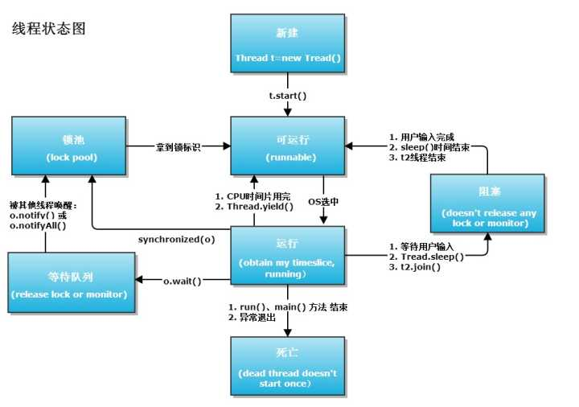

# Java中线程状态切换

Java中Thread的状态:  
`Thread.State`|Description
:--|:--
NEW|A thread that has not yet started is in this state.
RUNNABLE|A thread executing in the Java virtual machine is in this state.
BLOCKED|A thread that is blocked waiting for a monitor lock is in this state.
WAITING|A thread that is waiting indefinitely for another thread to perform a particular action is in this state.
TIMED_WAITING|A thread that is waiting for another thread to perform an action for up to a specified waiting time is in this state.
TERMINATED|A thread that has exited is in this state.

线程的生命周期大体可以分为5种：  
* 新建状态（New）：新创建了一个线程对象。
* 就绪状态（Runnable）：线程对象创建后，其他线程调用了该对象的start()方法。该状态的线程位于可运行线程池中，变得可运行，等待获取CPU的使用权。
* 运行状态（Running）：就绪状态的线程获取了CPU，执行程序代码。
* 阻塞状态（Blocked）：阻塞状态是线程因为某种原因放弃CPU使用权，暂时停止运行。直到线程进入就绪状态，才有机会转到运行状态。阻塞的情况分三种：
  * 等待阻塞：运行的线程执行wait()方法，JVM会把该线程放入等待池中。
  * 同步阻塞：运行的线程在获取对象的同步锁时，若该同步锁被别的线程占用，则JVM会把该线程放入锁池中。
  * 其他阻塞：运行的线程执行sleep()或join()方法，或者发出了I/O请求时，JVM会把该线程置为阻塞状态。当sleep()状态超时、join()等待线程终止或者超时、或者I/O处理完毕时，线程重新转入就绪状态。
* 死亡状态（Dead）：线程执行完了或者因异常退出了run()方法，该线程结束生命周期。

Ref.:  
JDK docs - Thread.State  
[Java 实例 - 获取线程状态](http://www.runoob.com/java/thread-status.html)  
[一张图让你看懂JAVA线程间的状态转换](https://my.oschina.net/mingdongcheng/blog/139263)  

