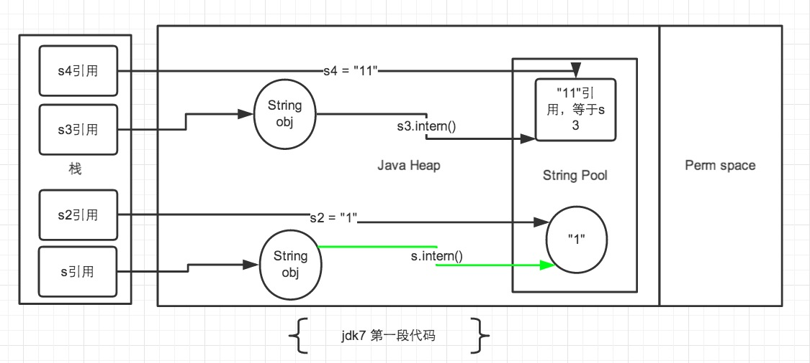

# Java字符串常量池

String不属于基本数据类型，是对象，默认值为null。但有其他对象没有的一些特性。

`new String()`和`new String("")`都是声明一个新的空字符串，非null。
```
public String() {
    this.value = "".value;
    this.coder = "".coder;
}
@HotSpotIntrinsicCandidate
public String(String original) {
    this.value = original.value;
    this.coder = original.coder;
    this.hash = original.hash;
}
```
直接使用双引号声明出来的String对象会直接存储在常量池中。
如果不是用双引号声明的String对象，可以使用String提供的intern方法。intern 方法会从字符串常量池中查询当前字符串是否存在，若不存在就会将当前字符串放入常量池中。

原来JDK默认字符串常量池的长度是1009且不可扩展。可以使用`-XX:StringTableSize`参数指定大小。  
看到很多地方说这个数字要使用质数，在[《Java 6,7,8 中的 String.intern – 字符串池》](http://blog.csdn.net/cq1982/article/details/45958049)一文看到一句话：“为了减少碰撞。”  
字符串池是使用一个拥有固定容量的HashMap，每个元素包含具有相同hash值的字符串列表。  
自Java 7u40后字符串常量池增大到60013。

Java确保一个字符串常量池只有一个拷贝。
```
String s0 = "kill";
String s1 = "kill";
String s2 = "ki" + " ll";
System.out.println(s0 == s1);
System.out.println(s0 == s2);
```
输出：
```
true
true
```
因为s0和s1保存的时字符串常量，在编译期就确定了，所有s0==s1 -> true。
而“ki”和“ll”也是字符串常量，当一个字符串由多个字符串常量连接而成时，自己也是字符串常量池，所以s2在编译期也被解析成字符串常量，s2也是字符串常量池中“kill”的一个引用。

```
String s0 = "kill";
String s1 = new String("kill");
System.out.println(s0 == s1);
String s2 = "ki" + new String("ll");
System.out.println(s0 == s2);
System.out.println(s0 == s2);
```
输出：
```
false
fasle
false
```
s0保存的还是对常量池中“kill”的引用。
s1因为无法在编译期确定，所以是运行时创建的新对象“kill”的引用。
s2因为`new String("ll")`同样无法在编译期确定，也是新创建对象的引用。

运行时也可以将新的常量放入常量池，典型的如`String.intern()`。
当一个String实例调用intern()后，JDK1.7后返回常量池中首次出现的实例引用，如果没有则增加一个Unicode相同的字符串并返回引用。
```
String str1 = new StringBuilder("机").append("会").toString();
System.out.println(str1.intern()==str1);
String str2 = new StringBuilder("ja").append("va").toString();
System.out.println(str2.intern()==str2);
```
输出：
```
true
false
```
有两点需要注意：
* StringBuilder创建的字符串实例在堆上
* 在调用str2.intern()之前“java”已经存在于字符串常量池。

```
String s = new String("1");
String s2 = "1";
s.intern();
System.out.println(s == s2);

String s3 = new String("1") + new String("1");
String s4 = "11";
s3.intern();
System.out.println(s3 == s4);
System.out.println(s3.intern() == s4);
```
输出:  
```
false
false
true
```



Ref.:  
[JAVA 字符串常量池](http://huoyj.iteye.com/blog/1529999)  
[深入解析String#intern](https://tech.meituan.com/in_depth_understanding_string_intern.html)  

