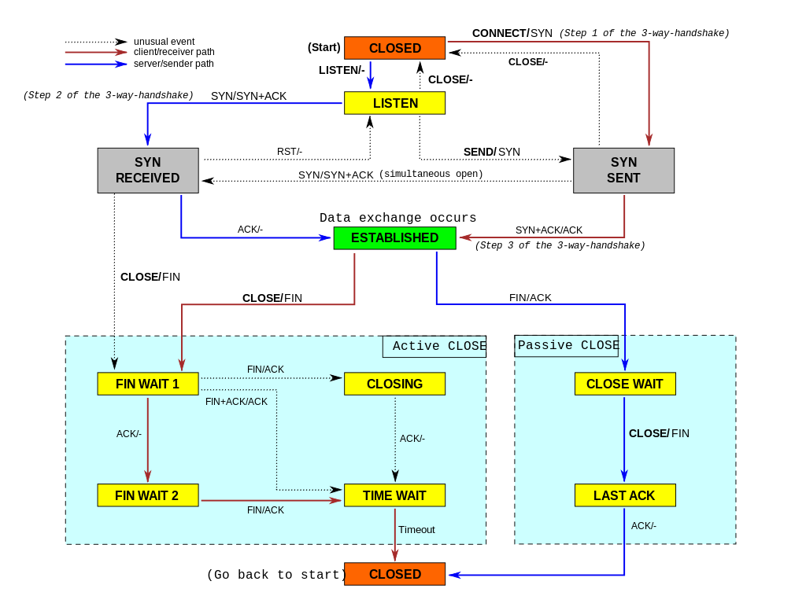

# TCP三次握手、四次挥手

### TCP三次握手

* Host A *sends* a TCP **SYN**chronize packet to Host B(seq=A(random))
* Host B *receives* A's **SYN**
* Host B *sends* a **SYN**chronize-**ACK**nowledgement(seq=B(random), ACK=A+1)
* Host A *receives* B's **SYN-ACK**
* Host A *sends* **ACK**nowledge(seq=A+1, ACK=B+1)
* Host B *receives* **ACK** 
* TCP socket connection is **ESTABLISHED**

### TCP四次挥手

当一个端点要停止它这一侧的连接，就向对侧发送FIN，对侧回复ACK表示确认。因此，拆掉一侧的连接过程需要一对FIN和ACK，分别由两侧端点发出。

* A发出FIN，进入FIN_WAIT_1状态，表示没有数据要发送
* B接收到A发送的FIN，向A发送一个ACK，A进入FIN_WAIT_2状态，表示B同意A的关闭请求
* B向A发送FIN请求关闭连接，B进入LAST_ACK状态
* A收到B发送的FIN后向B发送ACK，并进入TIME_WAIT状态。B收到A发送的ACK就关闭连接；A等待2MSL后没有收到回复，就表示B正常关闭，那么A关闭连接。

也可通过三次握手关闭连接：  
> 主机A发出FIN，主机B回复FIN & ACK，然后主机A回复ACK。

### TCP状态图

下表为TCP状态码列表，以S指代服务器，C指代客户端，S&C表示两者，S/C表示两者之一:  

状态|端|描述
:--|:--|:--
LISTEN|S|服务器等待从任意远程TCP端口的连接请求。侦听状态。
SYN-SENT|C|客户端在发送连接请求后等待匹配的连接请求。通过connect()函数向服务器发出一个同步（SYNC）信号后进入此状态。
SYN-RECEIVED|S|服务器已经收到并发送同步（SYNC）信号之后等待确认（ACK）请求。
ESTABLISHED|S&C|服务器与客户端的连接已经打开，收到的数据可以发送给用户。数据传输步骤的正常情况。此时连接两端是平等的。这称作全连接。
FIN-WAIT-1|S&C|（服务器或客户端）主动关闭端调用close（）函数发出FIN请求包，表示本方的数据发送全部结束，等待TCP连接另一端的ACK确认包或FIN&ACK请求包。
FIN-WAIT-2|S&C|主动关闭端在FIN-WAIT-1状态下收到ACK确认包，进入等待远程TCP的连接终止请求的半关闭状态。这时可以接收数据，但不再发送数据。
CLOSE-WAIT|S&C|被动关闭端接到FIN后，就发出ACK以回应FIN请求，并进入等待本地用户的连接终止请求的半关闭状态。这时可以发送数据，但不再接收数据。
CLOSING|S&C|在发出FIN后，又收到对方发来的FIN后，进入等待对方对己方的连接终止（FIN）的确认（ACK）的状态。少见。
LAST-ACK|S&C|被动关闭端全部数据发送完成之后，向主动关闭端发送FIN，进入等待确认包的状态。
TIME-WAIT|S/C|主动关闭端接收到FIN后，就发送ACK包，等待足够时间以确保被动关闭端收到了终止请求的确认包。【按照RFC 793，一个连接可以在TIME-WAIT保证最大四分钟，即最大分段寿命（maximum segment lifetime）的2倍】
CLOSED|S&C|完全没有连接。

### 为什么要三次挥手

解决**网络中存在延迟的分组**的问题。

考虑一种情况：  
A发出连接请求，因为SYN丢失而未收到ACK。于是A再次发送SYN，并收到B对此次请求的ACK，建立连接。数据传输完毕后就释放连接。A共发送了两个SYN，其中第一个丢失，第二个到达B，没有“**已失效的连接请求报文**”。

假定一种异常情况：  
A发出的第一个SYN没有丢失，而是在某些网络结点长时间滞留，以致延长到连接释放后才到达B，本来这个SYN是已失效的，但B收到后误认为A又发送了一个新的连接请求，于是向A发送了ACK，同意建立连接。如果不采用三次握手，那么只要B发出请求，连接就建立了。  
由于A没有发出新的连接建立请求，所以不会理睬B的确认，也不会向B发送数据，但B却以为新的连接已经建立，并一直等待A发送数据。这样系统资源就被浪费了。  
如果采用三次握手，A不向B发送的ACK进行确认，B收不到确认就知道A并没有要求建立连接。

### 为什么要四次挥手

A进入FIN_WAIT_1状态后表示A没有数据发送，但仍接收B的数据；B发送ACK表示知道A已经完成数据发送，B依然可以发送数据给A，A收到ACK后进入FIN_WAIT_2状态  
当B发送FIN给A后，表示B也没有数据发送，B进入LAST_ACK。A收到FIN后发送ACK并进入TIME_WAIT。  
此时A并不知道ACK是否到达B，于是开始等待2MSL。如果ACK没有到达B，B就会超时重传FIN。

Ref.:  
[https://en.wikipedia.org/wiki/Transmission_Control_Protocol](https://en.wikipedia.org/wiki/Transmission_Control_Protocol)  
[TCP 3-Way Handshake (SYN,SYN-ACK,ACK)](http://www.inetdaemon.com/tutorials/internet/tcp/3-way_handshake.shtml)  
[通俗大白话来理解TCP协议的三次握手和四次分手](https://github.com/jawil/blog/issues/14)  

