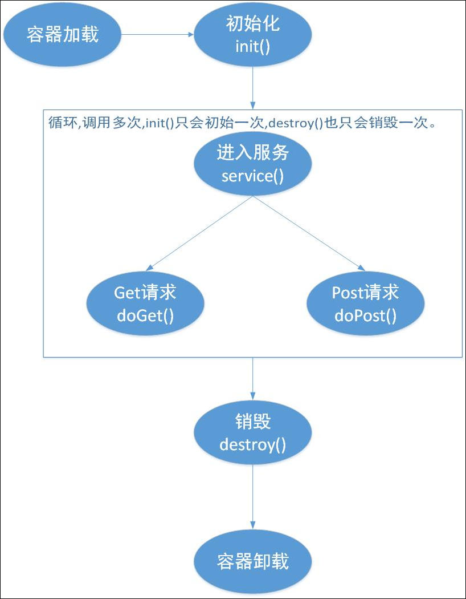

# Servlet生命周期

Servlet程序是由Web容器调用，Web容器实现了对Servlet生命周期的管理。其生命周期可以归纳为：  
Servlet加载 -> 实例化 -> 初始化 -> 服务 -> 销毁

### 1. 创建Servlet实例

Web容器负责加载Servlet，当web容器启动或第一次使用这个Servlet时，容器负责创建Servlet实例，但用户必须通过部署描述符（web.xml）指定Servlet的位置，也就是Servlet的实现类。  
成功加载后，web容器会通过反射的方式对Servlet进行实例化。

### 2. 调用init()方法对Servlet进行初始化

主要是为了让Servlet对象在处理客户请求前可以完成一些初始化工作，如获取配置信息等。

对于每一个Servlet实例，init()方法只会被调用一次。  
init()方法由一个ServletConfig类型的参数，Servlet容器通过该参数向Servlet传递配置（K-V）。  
另外，Servlet还可以通过ServletConfig对象获取描述Servlet运行环境的ServletContext对象，使用该对象，Servlet可以与它的Servlet容器进行通信。

### 3. service()响应客户端请求

service()是Servlet的核心，负责响应客户端请求。

### 4. 调用destroy()方法

当容器检测到一个Servlet实例应当从服务器中移除时，就调用实例的destroy()方法。该方法仅执行一次。

Ref.:  
[servlet 生命周期详解](http://www.51gjie.com/javaweb/846.html)

