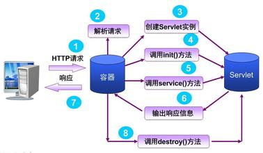

# Servlet运行工作原理

### 1. 工作流程

1. Web Client 向Servlet容器（Tomcat）发出Http请求
2. Servlet容器接收Web Client的请求
3. Servlet容器创建一个HttpRequest对象，将Web Client请求的信息封装到这个对象中。
4. Servlet容器创建一个HttpResponse对象
5. Servlet容器调用HttpServlet对象的service方法，把HttpRequest对象与HttpResponse对象作为参数传给 HttpServlet 对象。
6. HttpServlet调用HttpRequest对象的有关方法，获取Http请求信息。
7. HttpServlet调用HttpResponse对象的有关方法，生成响应数据。
8. Servlet容器把HttpServlet的响应结果传给Web Client。

### 2. 处理请求流程

1. 用户点击一个链接，指向了一个servlet而不是一个静态页面。
2. 容器“看出”这个请求是一个Servlet，所以它创建了两个对象HttpServletRequest和HttpServletResponse。
3. 容器根据请求中的URL找到正确的Servlet，为这个请求创建或分配一个线程，并把请求和响应对象传递给这个Servlet线程。
4. 容器调用Servlet的service()方法。根据请求的不同类型，service()方法会调用doGet()或doPost()方法。这里假设调用doGet()方法。
5. doGet()方法生成动态页面，并把这个页面“塞到”响应对象里，需要注意的是，容器还有响应对象的一个引用！
6. 线程结束，容器把响应对象转换为一个HTTP响应，并把它发回给客户，然后删除请求和响应对象。

### 3. 工作原理

1. 首先简单解释一下Servlet接收和响应客户请求的过程，首先客户发送一个请求，Servlet是调用service()方法对请求进行响应的，通过源代码可见，service()方法中对请求的方式进行了匹配，选择调用doGet,doPost等这些方法，然后再进入对应的方法中调用逻辑层的方法，实现对客户的响应。在Servlet接口和GenericServlet中是没有doGet（）、doPost（）等等这些方法的，HttpServlet中定义了这些方法，但是都是返回error信息，所以，我们每次定义一个Servlet的时候，都必须实现doGet或doPost等这些方法。
2. 每一个自定义的Servlet都必须实现Servlet的接口，Servlet接口中定义了五个方法，其中比较重要的三个方法涉及到Servlet的生命周期，分别是上文提到的init(),service(),destroy()方法。GenericServlet是一个通用的，不特定于任何协议的Servlet,它实现了Servlet接口。而HttpServlet继承于GenericServlet，因此HttpServlet也实现了Servlet接口。所以我们定义Servlet的时候只需要继承HttpServlet即可。
3. Servlet接口和GenericServlet是不特定于任何协议的，而HttpServlet是特定于HTTP协议的类，所以HttpServlet中实现了service()方法，并将请求ServletRequest、ServletResponse 强转为HttpRequest 和 HttpResponse。

Ref.:  
[servlet 运行工作原理详解](http://www.51gjie.com/javaweb/847.html)  

